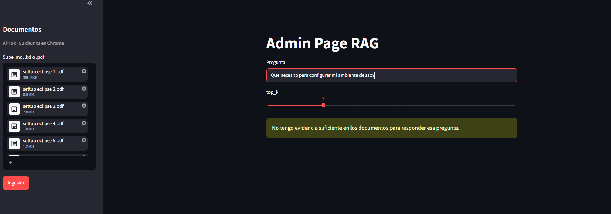
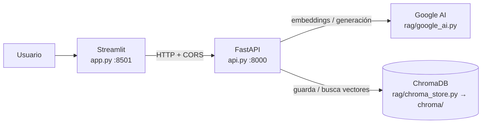
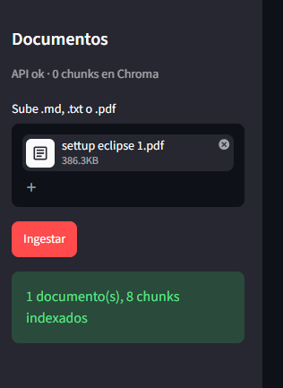
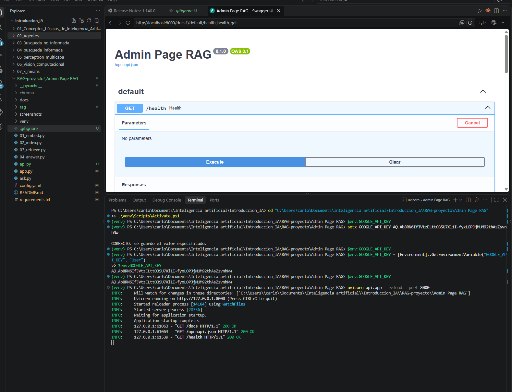
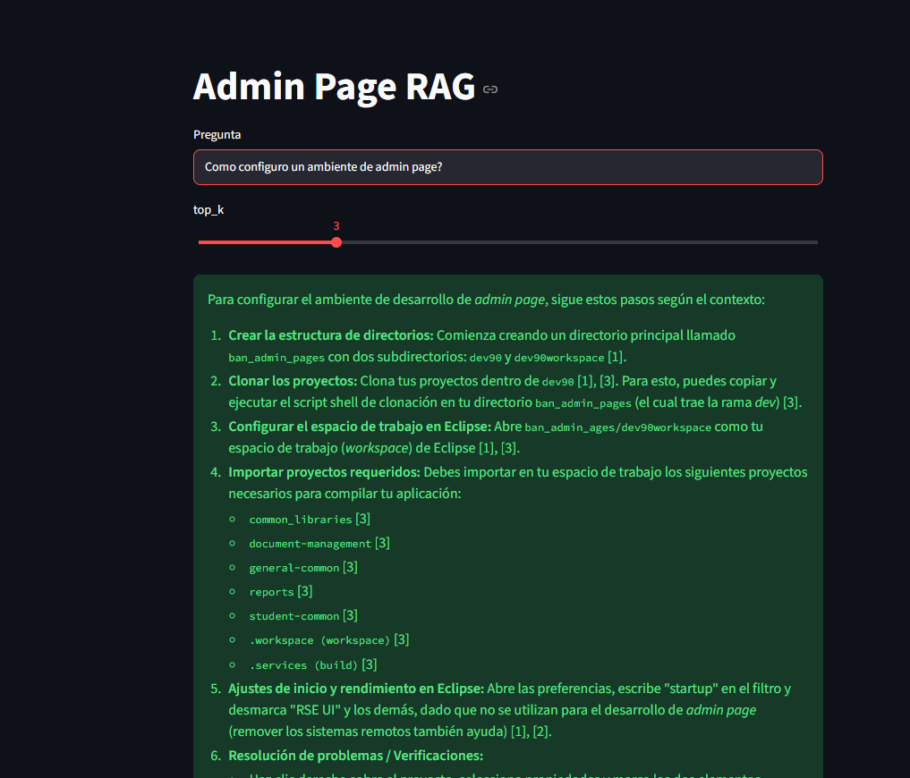
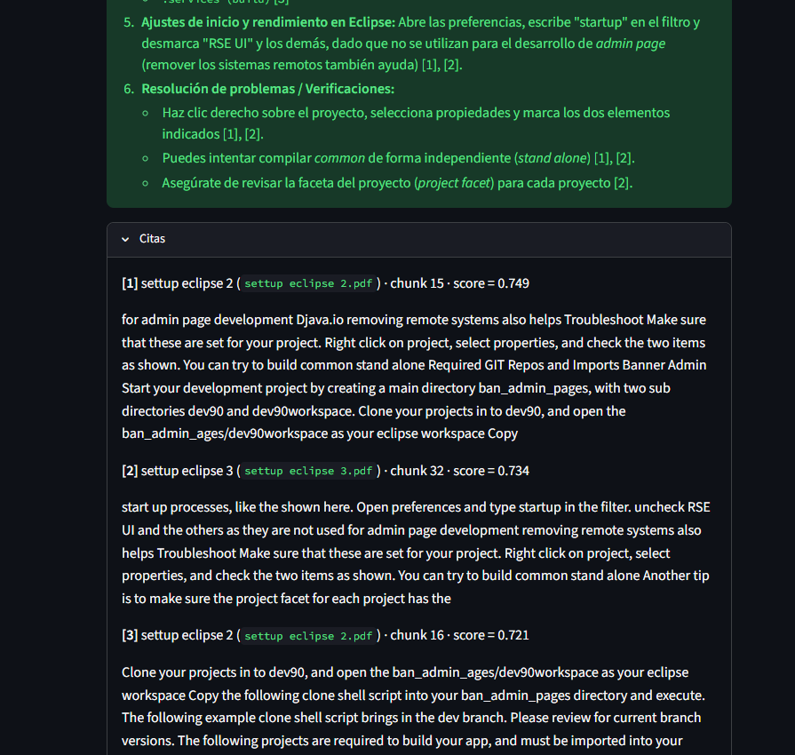
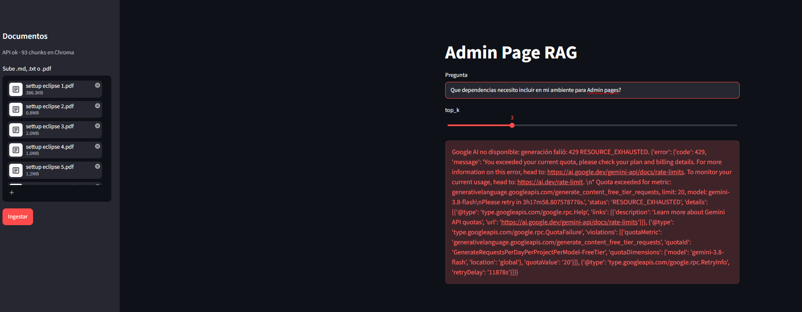
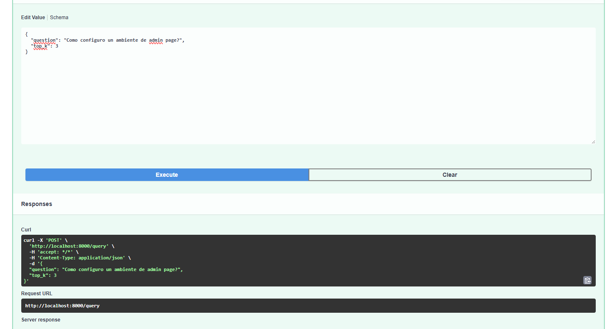
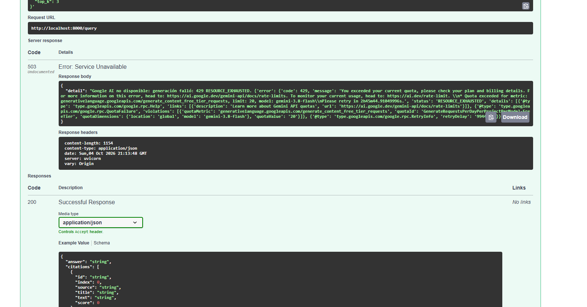
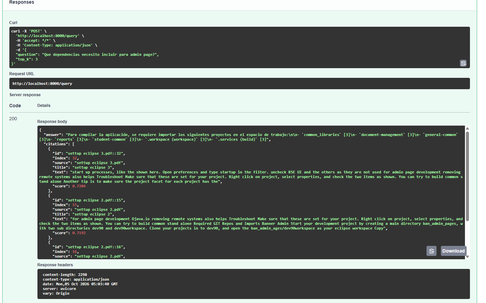

# Reporte — Admin Page RAG

## 1. Dominio y tamaño del corpus

**Dominio:** configuración del ambiente de desarrollo local para *Banner Admin Pages* (Tecnología de ellucian):
instalación y ajuste del IDE (Eclipse e IntelliJ), JDK, Maven (`settings.xml`),
Tomcat, plugins de Morphis Foundation, Java Batch, clonado de repositorios y
conexión a bases Oracle y PostgreSQL. Son guías técnicas paso a paso, en inglés.

| Documento | Páginas | Palabras | Chunks |
|---|---:|---:|---:|
| `settup eclipse 1.pdf` — Eclipse para Java Batch | 4 | 502 | 8 |
| `settup eclipse 2.pdf` — Eclipse para Banner Admin Pages | 13 | 1 555 | 24 |
| `settup eclipse 3.pdf` — Eclipse Setup Quick Guide (2023) | 27 | 3 918 | 61 |
| `settup eclipse 4.pdf` — Banner Admin en IntelliJ | 8 | 988 | 15 |
| `settup eclipse 5.pdf` — Banner Admin para PostgreSQL/Oracle | 20 | 1 987 | 31 |
| `settup eclipse 6.pdf` — Admin Pages 9.x en la máquina local | 18 | 1 855 | 29 |
| **Total (6 documentos)** | **90** | **10 805** | **168** |

**Modelo de embedding:** `gemini-embedding-001` (Google AI), vectores de 3 072
dimensiones. Detalle del corpus en [CORPUS.md](CORPUS.md).

## 2. Partición: 80 palabras por chunk, 15 de solapamiento

- **Tamaño (80 palabras ≈ 100–130 tokens).** El corpus son procedimientos:
  cada paso ("descarga X", "edita `config.ini`", "apunta a JDK 1.8") ocupa
  1–3 oraciones. Con 80 palabras, un chunk contiene uno o pocos pasos
  relacionados, así que su embedding representa un tema concreto y no una
  mezcla. Chunks más grandes diluyen la similitud; más pequeños pierden el
  contexto (qué herramienta, qué versión).
- **Solapamiento (15 palabras, ~19 %).** El corte es por palabras y puede caer
  a mitad de un paso; el solapamiento hace que ese paso aparezca completo en
  al menos uno de los dos chunks vecinos.
- **Unidad de corte:** cada archivo se parte por separado (un chunk nunca
  mezcla dos documentos). El texto se extrae con `pypdf`; los PDF escaneados
  sin capa de texto se reportan en `skipped`.
- Con `top_k = 3` el modelo recibe ~240 palabras de contexto: suficiente para
  un procedimiento corto sin meter ruido.

## 3. Cómo decide abstenerse

`POST /query` responde `abstained: true` (siempre con HTTP 200, nunca 500) en
tres casos, de más barato a más caro:

1. **Índice vacío:** no hay chunks en Chroma, así que no se llama al LLM.
2. **Umbral de similitud:** si el mejor chunk tiene similitud coseno menor que
   `api_min_score` (0.5 en `config.yaml`), la pregunta está fuera de dominio y
   no se llama al LLM. Como referencia, una pregunta del dominio ("¿cómo
   configuro eclipse en mac?") dio scores de 0.75–0.78. El 0.5 es un valor
   inicial conservador: el filtro fino lo hace el paso 3.
3. **Juicio del modelo:** el *system prompt* obliga a Gemini a responder solo
   con el contexto y a devolver exactamente `NO_EVIDENCE` si este no basta.
   Si aparece ese token, la API se abstiene. Este paso atrapa las preguntas
   que se parecen al dominio pero cuya respuesta no está en los documentos.

**Ejemplo de pregunta fuera de dominio — SSB9.** A la pregunta *"¿Qué necesito
para configurar mi ambiente de SSB9?"* el sistema se abstiene (captura
`Rag1.png`). Aunque suene parecida, SSB9 (*Self-Service Banner 9*) es una
tecnología muy diferente a Banner Admin Pages: son las aplicaciones web de
autoservicio para estudiantes, docentes y empleados, con su propio código,
despliegue y configuración, mientras que Admin Pages son las páginas
administrativas internas. Ninguno de los 6 documentos del corpus menciona
"SSB", "SSB9" ni "Self-Service", así que no hay evidencia para responder y lo
correcto es abstenerse en vez de rellenar con pasos de Admin Pages que no
aplican. Es el tipo de pregunta para el que existen los pasos 2 y 3: se parece
al dominio por vocabulario ("configurar", "ambiente"), pero su respuesta no
está en los documentos.

Los fallos de Google (falta de key, cuota, saturación) no son abstenciones:
devuelven 503 con el motivo, tras reintentar automáticamente ante 429/500/503.

## 4. Qué hace Google AI y qué hace Chroma

| Componente | Responsabilidad |
|---|---|
| **Google AI — embeddings** (`gemini-embedding-001`) | Convierte cada chunk (`task_type=RETRIEVAL_DOCUMENT`) y cada pregunta (`RETRIEVAL_QUERY`) en un vector. Es **el mismo modelo** para ambos; la colección guarda con qué modelo se creó y la API devuelve 409 si se intenta mezclar. |
| **Google AI — generación** (`gemini-3.8-flash`) | Recibe la pregunta y los `top_k` chunks numerados y redacta la respuesta citando `[n]`, o devuelve `NO_EVIDENCE`. No ve el resto del corpus. |
| **Chroma** (`chroma/`, persistente) | Guarda texto, vector y metadatos (`source`, `title`, `index`) de cada chunk; busca los `top_k` vecinos más cercanos por distancia coseno. **No calcula embeddings**: recibe los vectores ya hechos por Google. El índice sobrevive a los reinicios de FastAPI. |

**Flujo:** `/ingest` → `pypdf` → chunks → embeddings de Google → Chroma.
`/query` → embedding de la pregunta → Chroma (k-NN) → umbral → Gemini →
`answer` + `citations` + `abstained`.

## 5. Cómo se integraron las tecnologías

| Tecnología | Archivo | Cómo se incluyó |
|---|---|---|
| **FastAPI** (`fastapi`, `uvicorn`, `python-multipart`) | [api.py](api.py) | Es el centro del sistema: expone `GET /health`, `POST /ingest` (multipart con `files` y/o `paths`) y `POST /query` (JSON validado con Pydantic: `question` obligatoria, `top_k` entre 1 y 20). Traduce los fallos de Google a 503 y el cambio de modelo a 409, para no devolver nunca un 500. `CORSMiddleware` permite llamadas desde `localhost:8501`. Se ejecuta con `uvicorn api:app --port 8000`. |
| **Google AI** (`google-genai`) | [rag/google_ai.py](rag/google_ai.py) | Encapsula el SDK en dos funciones: `embed_texts()` (`gemini-embedding-001`, en lotes de 100 textos) y `generate()` (`gemini-3.8-flash`, con *system prompt* y `temperature=0.2`). El cliente lee `GOOGLE_API_KEY` del entorno o del `.env` y reintenta con *backoff* exponencial ante 429/500/503. Los modelos se cambian con variables de entorno, sin tocar código. |
| **ChromaDB** (`chromadb`) | [rag/chroma_store.py](rag/chroma_store.py) | `PersistentClient` en la carpeta `chroma/` (configurable con `chroma_dir`) y una colección `admin_page` con distancia coseno y `embedding_function=None`, porque los vectores llegan ya calculados por Google. `replace_source()` borra los chunks viejos de un archivo antes de insertar los nuevos (reingestar no duplica) y `search()` devuelve los `top_k` vecinos con `score = 1 − distancia`. La colección guarda el nombre del modelo de embeddings para impedir mezclar vectores de modelos distintos. |
| **Streamlit** (`streamlit`, `requests`) | [app.py](app.py) | Interfaz que **solo habla con la API** por HTTP (`API_URL`, por defecto `localhost:8000`): muestra el estado de `/health`, sube archivos a `/ingest` y envía preguntas a `/query` con un control para `top_k`. Pinta la respuesta en verde o la abstención en amarillo, y las citas con fuente, chunk y score. Se ejecuta con `streamlit run app.py`. |

La lectura de archivos (`pypdf`) y el chunking se reutilizaron del pipeline
original ([rag/data.py](rag/data.py), [rag/chunk.py](rag/chunk.py)). La
configuración vive en [config.yaml](config.yaml) (tamaños, `top_k`, umbral,
carpetas) y en `.env` (key y modelos; plantilla en [.env.example](.env.example)).

## 6. Evidencias

